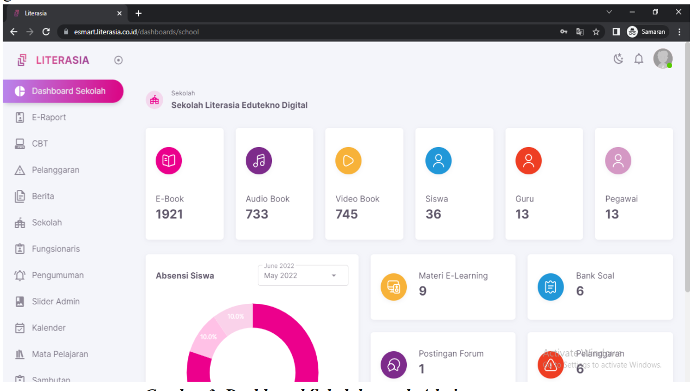

# Literasia - Sistem Informasi Sekolah Digital


**Literasia** adalah sistem informasi sekolah digital berbasis web yang dirancang untuk mengelola berbagai aspek kegiatan pendidikan secara efisien dan modern.



## ✨ Fitur Utama

### 📚 E-Library
- **E-Book Reader** - Pembaca PDF dengan efek Page Flip 3D interaktif
- **Audio Book** - Koleksi buku audio dengan pemutar terintegrasi
- **Video Book** - Konten video edukasi dengan modal player
- **Sistem Peminjaman** - Pencatatan pinjaman dan pengembalian koleksi digital

### 📊 Dashboard Dinamis
- Statistik real-time (Koleksi, Siswa, Guru, Pegawai)
- Grafik absensi siswa hari ini
- Quick access ke berbagai modul

### 🎓 Manajemen Akademik
- **E-Raport** - Pengelolaan rapor digital
- **E-Learning** - Materi pembelajaran online
- **Bank Soal** - Repositori soal untuk ujian
- **CBT (Computer Based Test)** - Ujian berbasis komputer

### 👥 Manajemen Pengguna
- Siswa, Guru, dan Pegawai
- Role-based access control
- Profil dengan avatar upload

### 📱 Fitur Lainnya
- **Forum Diskusi** - Ruang diskusi antar pengguna
- **E-Voting** - Pemilihan digital (OSIS, dll)
- **Kalender Akademik** - Jadwal kegiatan sekolah
- **Pengumuman & Berita** - Informasi sekolah
- **Sertifikat Guru** - Manajemen sertifikasi
- **Pelanggaran Siswa** - Pencatatan pelanggaran

## 🛠️ Tech Stack

| Layer | Technology |
|-------|------------|
| Backend | Laravel 11, PHP 8.2+ |
| Frontend | Blade, TailwindCSS 3, Alpine.js |
| Database | MySQL / MariaDB |
| PDF Rendering | PDF.js |
| Page Flip Effect | StPageFlip |
| Notifications | SweetAlert2 |

## 📋 Requirements

- PHP >= 8.2
- Composer
- Node.js >= 18
- MySQL / MariaDB

## 🚀 Installation

1. **Clone repository**
   ```bash
   git clone https://github.com/your-username/literasia-web.git
   cd literasia-web
   ```

2. **Install dependencies**
   ```bash
   composer install
   npm install
   ```

3. **Environment setup**
   ```bash
   cp .env.example .env
   php artisan key:generate
   ```

4. **Configure database** in `.env`
   ```env
   DB_CONNECTION=mysql
   DB_HOST=127.0.0.1
   DB_PORT=3306
   DB_DATABASE=literasia
   DB_USERNAME=root
   DB_PASSWORD=
   ```

5. **Run migrations**
   ```bash
   php artisan migrate
   ```

6. **Link storage**
   ```bash
   php artisan storage:link
   ```

7. **Build assets & serve**
   ```bash
   npm run dev
   php artisan serve
   ```

## 📁 Project Structure

```
literasia-web/
├── app/
│   ├── Http/Controllers/    # Controllers
│   └── Models/              # Eloquent Models
├── database/
│   └── migrations/          # Database migrations
├── resources/
│   ├── views/               # Blade templates
│   │   ├── layouts/         # Layout templates
│   │   ├── pages/           # Page views
│   │   └── components/      # Blade components
│   ├── css/                 # Stylesheets
│   └── js/                  # JavaScript
├── routes/
│   └── web.php              # Web routes
├── public/                  # Public assets
└── screenshots/             # App screenshots
```

## 📸 Screenshots

Letakkan screenshot aplikasi di folder `screenshots/`:
- `dashboard.png` - Halaman dashboard utama

## 🤝 Contributing

Contributions are welcome! Please feel free to submit a Pull Request.

## 📄 License

This project is licensed under the MIT License.

---

**Developed with ❤️ for education**
